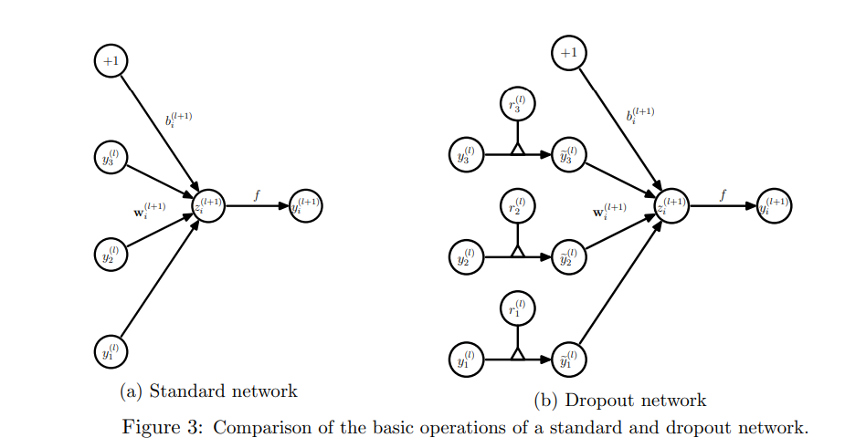
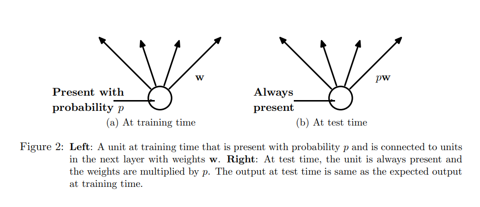
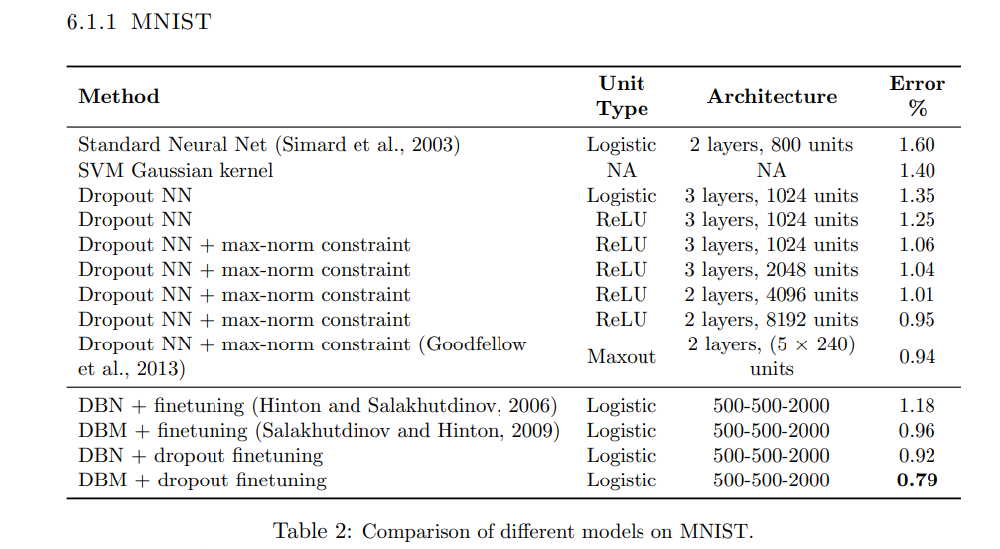

The post has been subdivided into following sub sections:-

1. **Why is dropout needed?**
2. **Introduction**
3. **Working**
4. **Dropout Implementation**
5. **Affects during test phase**
6. **Experimental Results**
7. **Conclusion**
8. **References**

# Why is dropout needed?
----

Deep Neural Nets are an expressive models providing complicated relationships among their parameters and output values. The dataset provided to the model are split into mainly training and testting. The models trained on limited training data will have less territory to explore and hence generalize well on the training dataset but will fail on the real data (test data). Limited training data generates sampling noise, affecting the relationships & results which leads to overfitting. 

One of the alternative proposed for neural nets are the regularization methods. It includes penalizing the weights upon observing the model performance on validation data and stopping the training when the validation error do not improve further.  One can also make use of ensemble of neural nets with distinct architecture. This method require high computing power and getting opitimal hyperparameters for fine tuning in large network is difficult, therefore expensive to train. 

> “With unlimited computation, the best way to *regularize* a fixed size model is to average the predictions of all possible 
> settings of parameters, weighting each setting by its posterior probability given the training data. ” 

# Introduction
-------

Dropout is an approach introduced to solve the above problem of overfitting and model averaging.
It is a technique which temporarily removes units, forward and backward connections from the parent, giving rise to a new network. The choice for dropping a unit is random and its retention is based on the probability p set by the user. 

The new network created upon dropout are referred as *thinned* network, with a total possiblity of 2^n   considering a parent network having n nodes. It can be thought of as training a collection of multiple new networks with extensive weight sharing.

An example has been provided below:
	Consider a network with input X= {1,2,3,4,5,6,7,8} with p= 0.4. It means a new *thinned* network can be create with   a 40% of the n=8 values being random dropped i.e 5 values being retained. 
	The possible sets are X1= {1,0,3,0,5,6,0,8}, X2= {0,2,3,4,0,6,7,0} and so on.
	
	For the hidden units having let’s assume 1000 neurons with p=0.5, then on every iteration a random of 500 nodes will be dropped.

> “For the input units, however, the optimal probability of retention is usually closer to 1 than to 0.5.”

In case of hidden layers, taking the value north of 0.5 results in a much sparse network. Hence the optimal value of hidden layer is considered as 0.5.
 
# How dropout is helpful?
-------

A regular neural net makes use of derivative function received from all parameters to make modifications in its loss function with the motive to reduce the gap between the predictions and actual outputs. The modification takes into consideration the mistakes from other parameter as well, developing a complex relationships among themselves, leading to over generalisation in training data and hence causing overfitting.

The dropout prevents **“co-adaptation”** by making the hidden units unavailable time to time, hence a model can rely on a particular parameter to make changes in its loss function. The training is performed on multiple networks based on the number of iterations, hence giving the model a wider ground to experiment and improve.

This ensures the model is getting generalised and hence reducing the overfitting problem. 

A side effect of dropout is sparsity in activations of hidden units. A good sparse network has few highly activatated units. Upon experimentation on auto-encoders it is found that the mean activations are high with fewer units. Hence, dropout can be used as an alternative to activity regularization in auto-encoder models. 

## Dropout Implementation
------------

The mathematical implementation of the dropout is demonstrated below:
	
The standard network can be represented as below:
	

	
zi(l+1) = Output vector from layer l+1 before activation

yl = Output vector from layer l

wi = Weight for the layer l

bi = Bias for the layer l

On implementing dropout, the forward equation changes to:
	

	
Before calculating the value of z, the input layer is sampled and multiplied elementwise by independent Bernoulli variables. rj(l)  denotes the independent bernoulli varibles  each having a probability of being 1. The operation is done to get *thinned* results *y(bar)*, which is used further up in the feedforward propagation.

	
# Affects during test phase 
------------
Dropout is not implemented after training, when making predictions on test data. 

The final weights obtained are larger than normal due to dropout, hence scaling of weights need to be done by using the value dropout rate. 

This operation can be performed in training period itself, at the end of each iteration and leaving weights unchanged during testing. The network derived can be used to make final predictions.

# Experimental Results
-------------------------
Below are the results depicting the error rate on experimentation of the MNIST, CIFAR-10 & CIFAR-100 with different architecture.

	

	
# Conclusion
------------------------------
Dropout is a general approach and can be implemented with most of the neural networks, like multi-layer perceptrons and convolutional Neural Net. When using Recurrent NN, it is desirable to use different dropout rate for input and recurrent connections. 

Dropout is found to improve results in various applications like Object Classification, Image Detection, Speech Recognition etc. 

# References 
------------------------------------------
[Srivastava et.al 2014](https://www.jmlr.org/papers/volume15/srivastava14a/srivastava14a.pdf?utm_content=buffer79b43&utm_medium=social&utm_source=twitter.com&utm_campaign=buffer)

[Dropout for regularizing deep neural network](https://machinelearningmastery.com/dropout-for-regularizing-deep-neural-networks/)

[Dropout in neural network](https://towardsdatascience.com/dropout-in-neural-networks-47a162d621d9)

